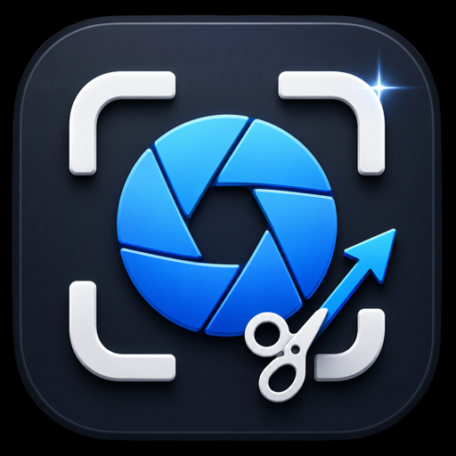

# Take a Shot

<p align="center">
  
</p>

Take a Shot is a local-first macOS app for screenshots, screen recordings,
non-destructive annotations, and searchable capture history. It requires macOS
14 or later and uses only native Apple frameworks.

## Build and run

Open `TakeAShot.xcodeproj` in Xcode, select the `TakeAShot` scheme, and run the
app on **My Mac**. You can also build and launch it from Terminal:

```bash
./script/build_and_run.sh
```

Run the automated macOS test suite before launching the app with:

```bash
./script/build_and_run.sh --verify
```

The verification command exits without launching the app if the build or tests
fail. The script also supports `--debug`, `--logs`, and `--telemetry`.

## Capture screenshots

Use the capture rail to choose a mode, configure the cursor, desktop-window,
and three-second delay options, and then start the capture.

- **Area** opens an overlay on each display. Drag to select an area, press
  **Return** to capture the current display, or press **Esc** to cancel.
- **Window** prompts you to choose an available window.
- **Fullscreen** captures a display at its native pixel dimensions.
- **Scrolling** prompts you to choose a window and then scrolls it vertically
  while showing frame and pixel progress. You can cancel while it runs.

Press **Shift-Option-5** anywhere in macOS to open the area-selection overlay.
Each completed image is saved to the local library and opened in the editor.

Scrolling capture stops at 100 frames, 30,000 output pixels, or 60 seconds. It
also limits source width to 8,192 pixels and temporary output to 128 MiB. If a
safety limit produces a usable partial image, the app asks you to use or discard
it. Apps that block synthetic scrolling, protected content, changing layouts,
or frames without a reliable overlap can stop the operation with an error.

## Annotate and export

Choose a tool in the editor toolbar, and then work directly on the image:

- Drag with **Arrow**, **Highlight**, **Blur**, or **Crop**.
- Click with **Text**, enter the text, and press **Return** to commit it. Press
  **Esc** to cancel the pending text.
- Use **Select** to click an annotation, drag it to move it, or drag a corner
  handle to resize it. Press **Delete** to remove the selected annotation.
- Use the toolbar or **Command-Z** and **Shift-Command-Z** to undo and redo.
- Adjust zoom from 25% to 400%. The inspector exposes the applicable color,
  stroke width, font size, highlight opacity, or blur radius control.

Edits and crop state are non-destructive: the app keeps the original capture
and stores annotations separately. **Copy screenshot** renders the current
annotations to the clipboard. **Export** saves a full-resolution PNG or JPEG;
JPEG export uses a solid background when the source contains transparency.

## Record MP4 or GIF

Use the recording bar below the editor:

1. Choose **MP4** or **GIF**.
2. For MP4, enable system audio, microphone audio, both, or neither.
3. Select **Record Video** or **Record GIF**, and choose a display or window.
4. Select **Stop** to finalize the recording, or **Cancel** while the recording
   is preparing or active.

MP4 uses H.264 at up to 30 frames per second. GIF has no audio, records at no
more than 10 frames per second, and caps its longest edge at 1,280 pixels. GIF
output duration is capped at 60 seconds; frames beyond that limit are ignored.
GIF staging is also limited to 512 MiB. Completed recordings are stored in the
local library only after finalization succeeds.

## Search and manage the local library

The inspector shows thumbnails and metadata for saved screenshots, MP4 files,
and GIF files. Search matches the title, OCR text, capture kind, and tags without
case sensitivity. OCR runs after an image is saved, so a new capture can take a
moment to appear in text search.

For each record, you can add comma-separated tags, open it, copy it, export it,
reveal its original in Finder, or delete it after confirmation. Opening an
image restores its saved annotation document. Image exports include those
annotations; recording exports preserve the original MP4 or GIF.

The library is stored under
`~/Library/Application Support/TakeAShot/`. Deleting a record removes its owned
original, thumbnail, annotation document, and metadata.

## Permissions and recovery

macOS controls the following capabilities in **System Settings > Privacy &
Security**:

- **Screen & System Audio Recording** is required for screenshots and screen
  recordings. If access is denied, the app explains the failure and offers to
  open the relevant settings pane.
- **Accessibility** is required only for automatic scrolling capture. If access
  is denied, the app offers to open Accessibility settings.
- **Microphone** is required only when microphone audio is enabled for MP4. If
  access is denied, you can retry the same selected source without microphone
  audio or open Microphone settings yourself.

After granting Screen Recording or Accessibility access, macOS can require you
to restart the app before the change takes effect.

## Current scope

Cloud upload, public links, accounts, and synchronization are not supported.
Captures and recordings remain on this Mac unless you copy or export them.

Scrolling capture is vertical only. Recording and capture of protected content
can be restricted by macOS or by the source app.
